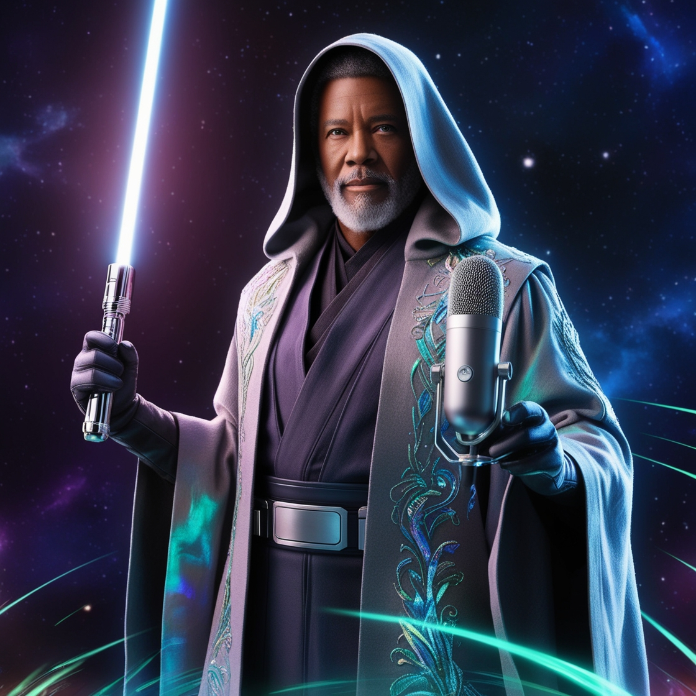

    preview do podcast

    <audio src="output/podcast_code_wars_editado.MP3" controls title="Podcast editado"></audio>

# Projeto Podcast Gerado por I.A.s

 > ℹ️ **NOTE:** Desafio de projeto da DIO - Criando um Podcast com IAs Generativas

## 💻 Tecnologias utilizadas no projeto

- [ChatGPT](https://chat.openai.com/) 
- [Leonardo.Ai](https://app.leonardo.ai/image-generation)
- [ElevenLabs](https://beta.elevenlabs.io/)
- [Capcut](https://www.capcut.com/pt-br/)

## ✨ Como foi feito ?

- Roteiro gerado via chatgpt
- Audio gerado pela elevenLabs
- Leonardo.Ai Para gerar capas
- Capcut para tratar aúdio e adicionar sons de fundo

---

⌨️ com 💜 por Marcus Britto
